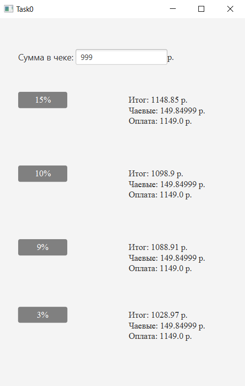
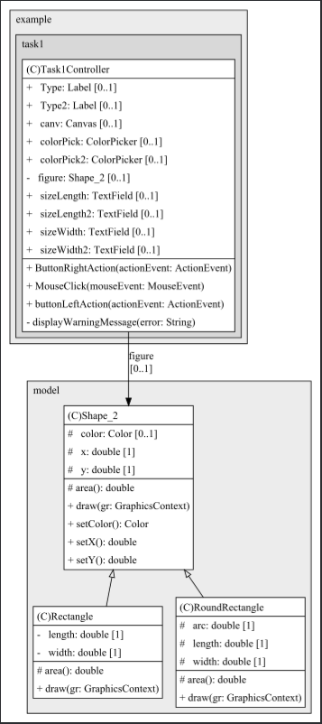
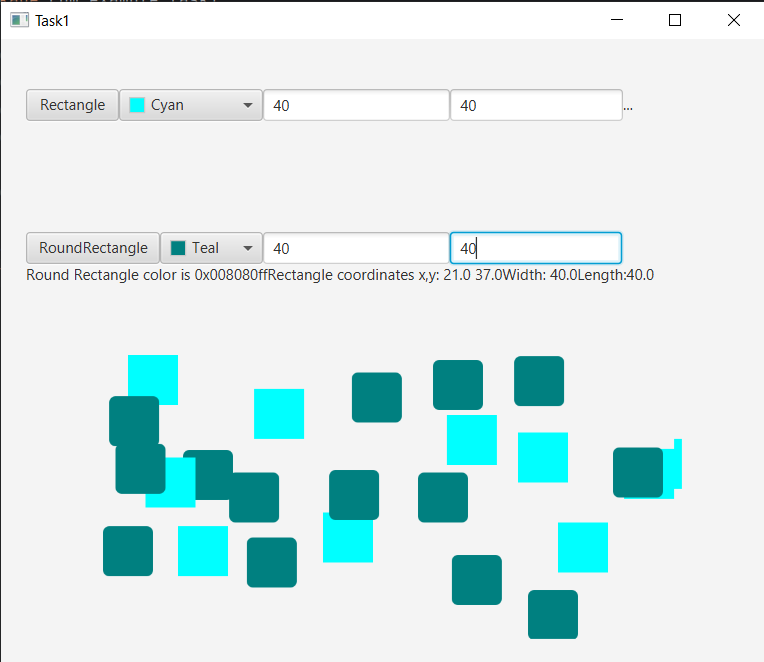
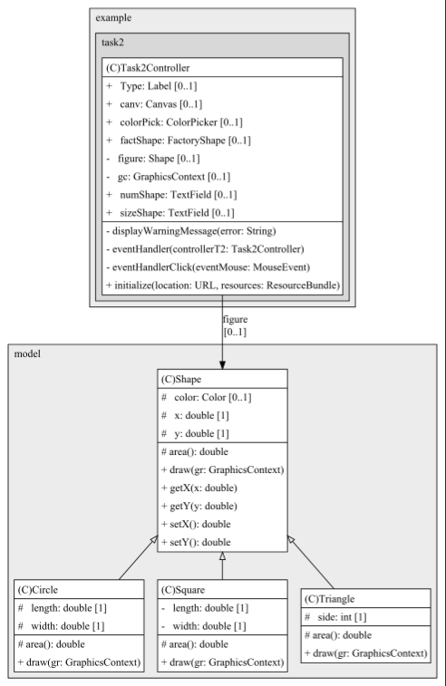
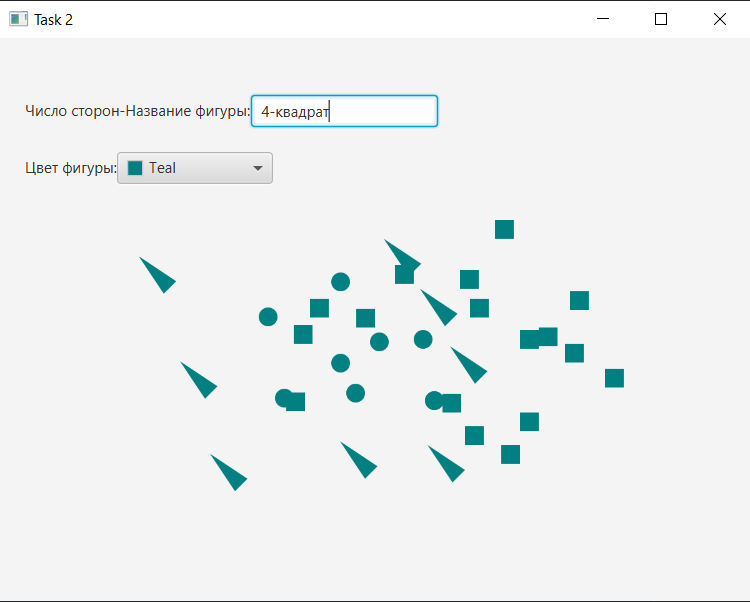

# ProgramTech_JavaFX

---

## Task 0 | Делегирование

### Условия задачи

Проблема. Получая чек в ресторане, Вы хотите дать "правильные" чаевые в зависимости от Вашего настроения - большие 15%,  обычные 10-9% или "мелочь"  3%.  

Требуется написать программу, которая в зависимости от введенной итоговой суммы  чека вычисляет, сколько Вы должны заплатить с учетом чаевых. (Чаевые зависят от настроения).  

### Теоритическая справка

Наследование - распространенный способ расширения и многократного использования функциональности класса. Делегирование представляет собой более общий подход к решению задачи расширения возможностей поведения класса. Этот подход заключается в том, что некоторый класс вызывает методы другого класса, а не наследует их.  Во многих ситуациях, не позволяющих использовать наследование, возможно применение делегирования. На рис. 1 показана возможность реализации множественного наследования через делегирование выполнения функций другому объекту. Или использования функциональности класса В в классе С без использования наследования.

### Результат компиляции

## Task 1 | Абстрактный суперкласс

### Постановка задачи

Разрабатывается  система автоматизированного проектирования. Базовым типом каждой  для каждой детали или строительной конструкции является «форма», и каждая форма имеет цвет, размер, идентификатор и другие характеристики. Все наследуемые конкретные типы фигур - блок, кирпич, стена и прочие., могут иметь дополнительные характеристики и поведение. Их характеристики могут дополняться, а  поведение может отличаться, например, формула вычисления площади поверхности каждой конкретной  фигуры, ее отображение - различно. Иерархия типов воплощает в себе как сходства, так и различия между формами.

### Условия задачи

ТРЕБУЕТСЯ НАПИСАТЬ ПРОГРАММУ, КОТОРАЯ РЕАЛИЗУЕТ СЛЕДУЮЩУЮ ИЕРАРХИЮ ДЛЯ ОТОБРАЖЕНИЯ ФИГУР И ПОЗВОЛЯЕТ ОТОБРАЗИТЬ УКАЗАННУЮ НА КНОПКЕ ПОЛЬЗОВАТЕЛЬСКОГО ИНТЕРФЕЙСА ФИГУРУ.  
Фигуры на выбор:  
1)круг, эллипс, прямоугольник, скругленный прямоугольник, квадрат (графический редактор);  
2)стена, окно, крыльцо, крыша, забор ("рисуем домик");  
3)блок ввод, решение, цикл, вывод (редактор блок-схем алгоритмов);  
4)элементы И, ИЛИ, НЕ, ИЛИ-НЕ, И-НЕ (построитель цифровых схем).  

### Теоритическая справка

Общая логика связанных классов определяется в суперклассе.   

Варианты поведения, зависящие от конкретного наследника, размещаются в методах с одинаковой сигнатурой и эти методы абстрактные.  

Abstract Superclass. Класс, выступающий в этой роли, представляет собой абст­рактный суперкласс, в котором инкапсулирована общая логика связанных клас­сов. Связанные классы расширяют этот класс. Таким образом, они могут на­следовать его методы. Методы с одинаковыми сигнатурами и общей логикой для всех связанных классов помещаются в суперкласс, поэтому логика этих ме­тодов может наследоваться всеми подклассами данного суперкласса. Методы с зависящей от конкретного подкласса данного суперкласса логикой, но с оди­наковыми сигнатурами, объявляются в абстрактном классе как абстрактные методы, тем самым гарантируя, что каждый конкретный подкласс будет иметь методы с такими же сигнатурами.  

ConcreteClassl, ConcreteClass2 и т.д. Класс, выступающий в этой роли, представ­ляет собой конкретный класс, чья логика и назначение связаны с другими конкретными классами. Методы, общие для этих связанных классов, помеща­ются в абстрактный суперкласс.  

### Диаграмма класов 

### Результат компиляции 

## Task 2 | Фабричный метод

### Условия задачи

Вариант 1. Требуется написать программу, которая  рисует фигуру по заданному пользователем числу сторон (0-круг, 1-отрезок, 2-угол, 3-треугольник и т.д)

### Теоритическая справка

Фабричный метод — это порождающий паттерн проектирования, который определяет общий интерфейс для создания объектов в суперклассе, позволяя подклассам изменять тип создаваемых объектов  

Для того чтобы система оставалась независимой от различных типов объектов, паттерн Factory Method использует механизм полиморфизма — классы всех конечных типов наследуют от одного абстрактного базового класса, предназначенного для полиморфного использования. В этом базовом классе определяется единый интерфейс, через который пользователь будет оперировать объектами конечных типов.  

Для обеспечения относительно простого добавления в систему новых типов паттерн Factory Method локализует создание объектов конкретных типов в специальном классе-фабрике. Методы этого класса, посредством которых создаются объекты конкретных классов, называются фабричными.  

### Диаграмма классов

### Результат компиляции 

